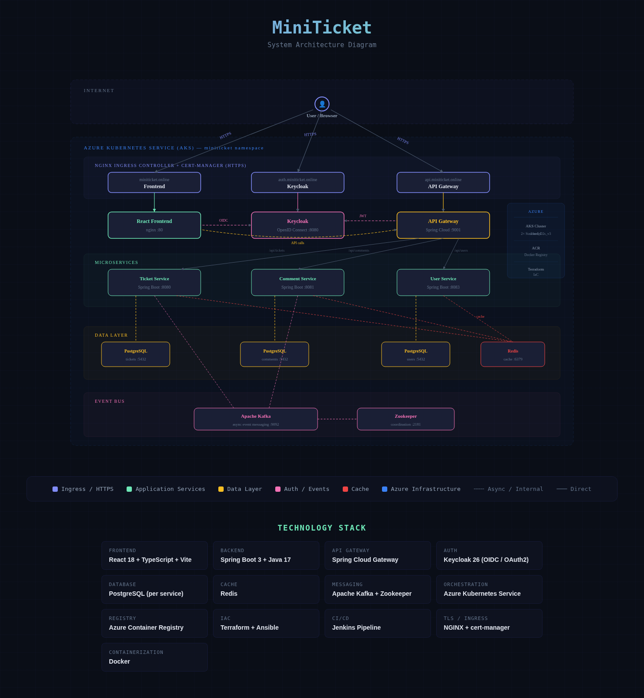

# 🎫 MiniTicket

## Title

**MiniTicket** — A full-stack, microservices-based ticket management system deployed on Azure Kubernetes Service with custom domain HTTPS.

🌐 **Live**: [https://miniticket.online](https://miniticket.online)

---

## Description

MiniTicket is a production-ready support ticket management platform where users can create, track, comment on, and resolve support tickets. The application is built using a microservices architecture with four independently deployable services, each with its own database, communicating through an API Gateway and Apache Kafka event bus.

**Key Features:**

- Create, view, update, close, and delete support tickets
- Add comments to individual tickets
- Search tickets and filter by status (All / Open / Closed)
- Priority levels (LOW, MEDIUM, HIGH) with color-coded badges
- Paginated ticket dashboard
- User profiles synced with Keycloak
- Keycloak-based authentication with OpenID Connect
- Self-service user registration
- Automatic logout after 10 minutes of inactivity
- Custom domain with free auto-renewing HTTPS certificates
- CI/CD pipeline with Jenkins

---

## Documentation

### Tech Stack

| Layer | Technology |
|-------|-----------|
| Frontend | React 18, TypeScript, Redux Toolkit, React Router v6, Vite |
| Backend | Java 17, Spring Boot 3, Spring Cloud Gateway, Spring Security OAuth2, Spring Data JPA |
| Authentication | Keycloak 26 (OpenID Connect / OAuth 2.0) |
| Databases | PostgreSQL (one instance per microservice) |
| Caching | Redis |
| Messaging | Apache Kafka + Zookeeper |
| Containerization | Docker |
| Orchestration | Azure Kubernetes Service (AKS) |
| Image Registry | Azure Container Registry (ACR) |
| Infrastructure as Code | Terraform |
| Automation | Ansible |
| CI/CD | Jenkins |
| Ingress / Load Balancing | NGINX Ingress Controller |
| TLS Certificates | cert-manager + Let's Encrypt |
| DNS | Namecheap |

### Microservices

**Ticket Service (`:8080`)** — Handles CRUD operations for support tickets. Each ticket has an id, subject, description, status (OPEN/CLOSED), priority (LOW/MEDIUM/HIGH), createdBy, and createdAt. Publishes events to Kafka on ticket creation and status changes.

**Comment Service (`:8081`)** — Manages comments linked to tickets via ticketId. Consumes Kafka events for cross-service communication.

**User Service (`:8083`)** — Manages user profiles synced with Keycloak identity data.

**API Gateway (`:9001`)** — Single entry point for all backend API requests. Routes traffic to the correct microservice, validates JWT tokens against Keycloak, and handles CORS.

### API Endpoints

All requests go through `https://api.miniticket.online` and require a valid JWT Bearer token.

**Tickets**

| Method | Endpoint | Description |
|--------|----------|-------------|
| `GET` | `/api/tickets` | List all tickets (paginated) |
| `GET` | `/api/tickets/{id}` | Get ticket by ID |
| `POST` | `/api/tickets` | Create a new ticket |
| `PUT` | `/api/tickets/{id}` | Update a ticket |
| `PATCH` | `/api/tickets/{id}/close` | Close a ticket |
| `DELETE` | `/api/tickets/{id}` | Delete a ticket |

**Comments**

| Method | Endpoint | Description |
|--------|----------|-------------|
| `GET` | `/api/comments/ticket/{ticketId}` | Get comments for a ticket |
| `POST` | `/api/comments` | Add a comment |
| `DELETE` | `/api/comments/{id}` | Delete a comment |

**Users**

| Method | Endpoint | Description |
|--------|----------|-------------|
| `GET` | `/api/users/me` | Get current user profile |
| `GET` | `/api/users/{username}` | Get user by username |

### Project Structure

```
miniTicket/
├── api-gateway/                       # Spring Cloud Gateway
│   ├── src/main/java/.../config/
│   │   ├── CorsConfig.java            # CORS allowed origins
│   │   └── SecurityConfig.java        # OAuth2 JWT validation
│   ├── src/main/resources/
│   │   └── application.yml            # Routes, JWT issuer config
│   ├── Dockerfile
│   └── pom.xml
│
├── ticket-service/                    # Ticket CRUD microservice
│   ├── src/main/java/.../
│   │   ├── controller/
│   │   ├── service/
│   │   ├── model/
│   │   └── repository/
│   ├── Dockerfile
│   └── pom.xml
│
├── comment-service/                   # Comment microservice
│   ├── src/main/java/.../
│   ├── Dockerfile
│   └── pom.xml
│
├── user-service/                      # User profile microservice
│   ├── src/main/java/.../
│   ├── Dockerfile
│   └── pom.xml
│
├── miniTicket-ui/                     # React frontend
│   ├── src/
│   │   ├── api/http.ts                # API client + Gateway URL
│   │   ├── auth/
│   │   │   ├── keycloak.ts            # Keycloak connection config
│   │   │   ├── AuthProvider.tsx        # Auth context + login/logout
│   │   │   └── IdleLogout.tsx          # 10-min inactivity auto-logout
│   │   ├── components/Navbar.tsx
│   │   ├── pages/
│   │   │   ├── TicketsDashboardPage.tsx
│   │   │   ├── TicketDetailPage.tsx
│   │   │   ├── CreateTicketPage.tsx
│   │   │   └── ProfilePage.tsx
│   │   └── store/                     # Redux state management
│   ├── nginx.conf                     # Production SPA routing
│   ├── Dockerfile                     # Multi-stage: node → nginx
│   ├── tsconfig.json
│   └── vite.config.ts
│
├── keycloak/                          # Keycloak configuration
│
├── infra/
│   ├── k8s/                           # Kubernetes manifests
│   │   ├── 00-namespace.yaml
│   │   ├── 01-secrets.yaml
│   │   ├── 10-postgres-ticket.yaml
│   │   ├── 11-postgres-comment.yaml
│   │   ├── 12-postgres-user.yaml
│   │   ├── 20-redis.yaml
│   │   ├── 30-zookeeper.yaml
│   │   ├── 31-kafka.yaml
│   │   ├── 40-keycloak.yaml
│   │   ├── 50-ticket-service.yaml
│   │   ├── 51-comment-service.yaml
│   │   ├── 52-user-service.yaml
│   │   ├── 53-api-gateway.yaml
│   │   ├── 60-frontend.yaml
│   │   ├── 95-cluster-issuer.yaml     # Let's Encrypt issuer
│   │   └── 96-ingress.yaml            # Ingress rules (3 domains)
│   │
│   ├── terraform/                     # Infrastructure as Code
│   │   ├── main.tf
│   │   ├── variables.tf
│   │   ├── terraform.tfvars
│   │   └── outputs.tf
│   │
│   └── ansible/
│       └── deploy.yaml                # Deployment automation
│
├── Jenkinsfile                        # CI/CD pipeline
├── docker-compose.yml                 # Local development
└── README.md
```

---

## Requirements

### Development Tools

| Tool | Version | Purpose |
|------|---------|---------|
| Java | 17+ | Backend microservices |
| Maven | 3.9+ | Java build tool |
| Node.js | 20+ | Frontend build |
| npm | 9+ | Frontend package manager |
| Docker Desktop | Latest | Container builds |

### Deployment Tools

| Tool | Version | Purpose |
|------|---------|---------|
| Azure CLI (`az`) | Latest | Azure resource management |
| kubectl | Latest | Kubernetes cluster management |
| Helm | 3.x | Installing ingress-nginx, cert-manager |
| Terraform | 1.5+ | Infrastructure provisioning |

### Azure Resources

| Resource | Specification |
|----------|--------------|
| Subscription | Active Azure subscription |
| AKS Cluster | 2 nodes, Standard_D2s_v3 |
| Container Registry | Basic tier |
| Public IPs | 1 (for NGINX Ingress) |
| Region | East US 2 |

### DNS

A domain name from any DNS provider (this project uses Namecheap with `miniticket.online`).

---

## Setup

### Local Development

**1. Clone the repository:**

```bash
git clone https://github.com/M-p1998/miniTicket.git
cd miniTicket
```

**2. Start infrastructure with Docker Compose:**

```bash
docker-compose up -d
```

This starts PostgreSQL databases, Kafka, Zookeeper, Redis, and Keycloak.

**3. Run backend services** (each in a separate terminal):

```bash
cd ticket-service && mvn spring-boot:run
cd comment-service && mvn spring-boot:run
cd user-service && mvn spring-boot:run
cd api-gateway && mvn spring-boot:run
```

**4. Run frontend:**

```bash
cd miniTicket-ui
npm install
npm run dev
```

**5.** Open `http://localhost:5173` in your browser.

---

### Azure / Kubernetes Deployment

**Step 1: Provision Infrastructure**

```bash
cd infra/terraform
terraform init
terraform plan
terraform apply
```

Creates Resource Group, AKS cluster, and Container Registry.

**Step 2: Connect to AKS**

```bash
az aks get-credentials --resource-group miniticket-rg --name miniticket-aks
kubectl get nodes
```

**Step 3: Build and Push Docker Images**

```bash
az acr login --name miniticketacr12345

docker build -t miniticketacr12345.azurecr.io/miniticket/frontend:latest ./miniTicket-ui
docker push miniticketacr12345.azurecr.io/miniticket/frontend:latest

docker build -t miniticketacr12345.azurecr.io/miniticket/api-gateway:latest ./api-gateway
docker push miniticketacr12345.azurecr.io/miniticket/api-gateway:latest

docker build -t miniticketacr12345.azurecr.io/miniticket/ticket-service:latest ./ticket-service
docker push miniticketacr12345.azurecr.io/miniticket/ticket-service:latest

docker build -t miniticketacr12345.azurecr.io/miniticket/comment-service:latest ./comment-service
docker push miniticketacr12345.azurecr.io/miniticket/comment-service:latest

docker build -t miniticketacr12345.azurecr.io/miniticket/user-service:latest ./user-service
docker push miniticketacr12345.azurecr.io/miniticket/user-service:latest
```

**Step 4: Deploy Kubernetes Manifests**

```bash
kubectl apply -f infra/k8s/00-namespace.yaml
kubectl apply -f infra/k8s/01-secrets.yaml
kubectl apply -f infra/k8s/10-postgres-ticket.yaml
kubectl apply -f infra/k8s/11-postgres-comment.yaml
kubectl apply -f infra/k8s/12-postgres-user.yaml
kubectl apply -f infra/k8s/20-redis.yaml
kubectl apply -f infra/k8s/30-zookeeper.yaml
kubectl apply -f infra/k8s/31-kafka.yaml
kubectl apply -f infra/k8s/40-keycloak.yaml
kubectl apply -f infra/k8s/50-ticket-service.yaml
kubectl apply -f infra/k8s/51-comment-service.yaml
kubectl apply -f infra/k8s/52-user-service.yaml
kubectl apply -f infra/k8s/53-api-gateway.yaml
kubectl apply -f infra/k8s/60-frontend.yaml
```

**Step 5: Install NGINX Ingress Controller**

```bash
helm repo add ingress-nginx https://kubernetes.github.io/ingress-nginx
helm repo update
helm install ingress-nginx ingress-nginx/ingress-nginx \
  --create-namespace --namespace ingress-nginx \
  --set controller.service.annotations."service\.beta\.kubernetes\.io/azure-load-balancer-health-probe-request-path"=/healthz
```

**Step 6: Install cert-manager**

```bash
helm repo add jetstack https://charts.jetstack.io
helm repo update
helm install cert-manager jetstack/cert-manager \
  --namespace cert-manager --create-namespace --set crds.enabled=true
```

**Step 7: Configure DNS**

Point your domain to the ingress external IP with A records:

| Host | Value |
|------|-------|
| `@` | Ingress external IP |
| `www` | Ingress external IP |
| `auth` | Ingress external IP |
| `api` | Ingress external IP |

**Step 8: Apply Ingress and Certificates**

```bash
kubectl apply -f infra/k8s/95-cluster-issuer.yaml
kubectl apply -f infra/k8s/96-ingress.yaml
kubectl get certificate -n miniticket    # All should show READY = True
```

**Step 9: Configure Keycloak**

Open `https://auth.miniticket.online` and log in with `admin` / `admin`:

1. Create realm: `miniTicket`
2. Realm Settings → Login → User registration: ON
3. Clients → Create: `miniTicket-ui` (public client, redirect URI: `https://miniticket.online/*`, web origins: `*`)
4. Users → Create test user with password

**Step 10: Verify**

```bash
curl -s https://auth.miniticket.online/realms/miniTicket | python3 -m json.tool
curl -s https://api.miniticket.online/actuator/health
```

Open `https://miniticket.online` → Sign in → Create a ticket.

---

## Architecture Diagram

```

```

### Request Flow

```
User → HTTPS → NGINX Ingress → Ingress Rules
                                    │
                    ┌───────────────┼───────────────┐
                    ▼               ▼               ▼
               Frontend        Keycloak        API Gateway
              (static UI)    (auth tokens)    (route + validate JWT)
                                                    │
                                    ┌───────────────┼───────────────┐
                                    ▼               ▼               ▼
                              /api/tickets    /api/comments    /api/users
                                    │               │               │
                                    ▼               ▼               ▼
                              PostgreSQL       PostgreSQL       PostgreSQL
```

### Domain Routing

| URL | Service | Port |
|-----|---------|------|
| `https://miniticket.online` | React Frontend (nginx) | 80 |
| `https://auth.miniticket.online` | Keycloak | 8080 |
| `https://api.miniticket.online` | API Gateway | 9001 |

---

## Testing

### Verify Infrastructure

```bash
# Check AKS nodes are ready
kubectl get nodes

# Check all pods are running
kubectl get pods -n miniticket

# Check ingress rules
kubectl get ingress -n miniticket

# Check TLS certificates
kubectl get certificate -n miniticket
```

### Verify Services

```bash
# Keycloak realm configuration
curl -s https://auth.miniticket.online/realms/miniTicket | python3 -m json.tool

# API Gateway health
curl -s https://api.miniticket.online/actuator/health

# Frontend
curl -s -o /dev/null -w "%{http_code}" https://miniticket.online
```

### Verify JWT Issuer

```bash
# Check Keycloak advertised issuer
kubectl exec -n miniticket deployment/api-gateway -- \
  curl -s http://keycloak:8080/realms/miniTicket/.well-known/openid-configuration \
  | grep -o '"issuer":"[^"]*"'

# Expected: "issuer":"https://auth.miniticket.online/realms/miniTicket"

# Check API Gateway environment
kubectl exec -n miniticket deployment/api-gateway -- env | grep KC
```

### Functional Testing

1. Open `https://miniticket.online`
2. Click **Register** → create a new account
3. Log in with the new account
4. Click **+ Create** → fill in subject, description, priority → **Create Ticket**
5. Verify the ticket appears in the dashboard
6. Click on a ticket → add a comment
7. Close the ticket using the close button
8. Filter tickets by status (Open / Closed)
9. Search for a ticket by subject
10. Check **Profile** page
11. Click **Logout** → verify redirect to login page
12. Leave the app idle for 10 minutes → verify auto-logout

### Redeployment Testing

After code changes, verify the update cycle works:

```bash
az acr login --name miniticketacr12345
docker build -t miniticketacr12345.azurecr.io/miniticket/<service>:latest ./<service>
docker push miniticketacr12345.azurecr.io/miniticket/<service>:latest
kubectl rollout restart deployment -n miniticket <service>
kubectl rollout status deployment -n miniticket <service>
```

---

## Configuration

### Kubernetes Secrets (`infra/k8s/01-secrets.yaml`)

| Key | Value | Description |
|-----|-------|-------------|
| `POSTGRES_USER` | `root` | Database username for all PostgreSQL instances |
| `POSTGRES_PASSWORD` | `bondstone` | Database password |
| `KEYCLOAK_ADMIN` | `admin` | Keycloak admin console username |
| `KEYCLOAK_ADMIN_PASSWORD` | `admin` | Keycloak admin console password |
| `KC_ISSUER` | `https://auth.miniticket.online/realms/miniTicket` | JWT issuer (must match token `iss` claim) |
| `KC_JWK_URI` | `http://keycloak:8080/realms/miniTicket/protocol/openid-connect/certs` | Internal JWK endpoint for key fetching |

### Keycloak Pod Environment

| Variable | Value | Description |
|----------|-------|-------------|
| `KC_HOSTNAME_URL` | `https://auth.miniticket.online` | External HTTPS URL Keycloak advertises |
| `KC_HOSTNAME_STRICT` | `false` | Allow flexible hostname handling |
| `KC_PROXY_HEADERS` | `xforwarded` | Trust X-Forwarded headers from ingress |
| `KC_HTTP_ENABLED` | `true` | Enable HTTP (TLS terminates at ingress) |

### API Gateway (`application.yml`)

```yaml
spring:
  security:
    oauth2:
      resourceserver:
        jwt:
          issuer-uri: ${KC_ISSUER:https://auth.miniticket.online/realms/miniTicket}
          jwk-set-uri: ${KC_JWK_URI:http://keycloak:8080/realms/miniTicket/protocol/openid-connect/certs}
```

### Frontend Configuration

| File | Variable | Value |
|------|----------|-------|
| `src/auth/keycloak.ts` | `url` | `https://auth.miniticket.online` |
| `src/api/http.ts` | `GATEWAY_BASE` | `https://api.miniticket.online` |

### CORS Configuration (`api-gateway/CorsConfig.java`)

```java
config.setAllowedOrigins(List.of(
    "http://localhost:5173",
    "https://miniticket.online",
    "https://www.miniticket.online"
));
```

### JWT Issuer Split Pattern

This is the most critical configuration for JWT authentication to work:

| Variable | URL | Used For |
|----------|-----|----------|
| `KC_ISSUER` | `https://auth.miniticket.online/realms/miniTicket` | External HTTPS — must match the `iss` claim in JWT tokens issued by Keycloak |
| `KC_JWK_URI` | `http://keycloak:8080/realms/miniTicket/protocol/openid-connect/certs` | Internal cluster URL — used by services to fetch Keycloak's public keys for token verification |
| `KC_HOSTNAME_URL` | `https://auth.miniticket.online` | Tells Keycloak its own external URL so it stamps tokens with the correct issuer |

### CI/CD Pipeline (`Jenkinsfile`)

```
Stages:
  1. Build      → Maven package for each microservice
  2. Docker     → Build Docker images
  3. Push       → Push to Azure Container Registry
  4. Deploy     → Apply Kubernetes manifests
  5. Restart    → Rolling restart of deployments
  6. Verify     → Confirm all pods are running
```

### Terraform Configuration (`infra/terraform/terraform.tfvars`)

```hcl
resource_group_name = "miniticket-rg"
location            = "eastus2"
cluster_name        = "miniticket-aks"
dns_prefix          = "miniticket-dns"
node_count          = 2
vm_size             = "Standard_D2s_v3"
acr_name            = "miniticketacr12345"
```

---

## Roadmap

- [x] Microservices architecture (Ticket, Comment, User, API Gateway)
- [x] React frontend with TypeScript
- [x] Keycloak authentication (OpenID Connect)
- [x] User registration and login
- [x] Ticket CRUD with priority and status management
- [x] Comments on tickets
- [x] Kafka event-driven communication between services
- [x] Redis caching layer
- [x] Docker containerization for all services
- [x] Azure Kubernetes Service deployment
- [x] Terraform infrastructure provisioning
- [x] Custom domain (miniticket.online) with HTTPS
- [x] NGINX Ingress Controller with cert-manager
- [x] Auto-renewing Let's Encrypt SSL certificates
- [x] Jenkins CI/CD pipeline
- [x] Ansible deployment automation
- [x] 10-minute idle auto-logout
- [x] Paginated ticket dashboard with search and filters


---

## Useful Commands

```bash
# View all pods
kubectl get pods -n miniticket

# View logs for a service
kubectl logs -n miniticket deployment/<service> --tail=50

# Restart a service after code change
kubectl rollout restart deployment -n miniticket <service>

# Check ingress and certificates
kubectl get ingress -n miniticket
kubectl get certificate -n miniticket

# Verify Keycloak issuer
kubectl exec -n miniticket deployment/api-gateway -- \
  curl -s http://keycloak:8080/realms/miniTicket/.well-known/openid-configuration \
  | grep -o '"issuer":"[^"]*"'

# Terraform plan
cd infra/terraform && terraform plan
```

---

## Troubleshooting

| Issue | Cause | Fix |
|-------|-------|-----|
| **401 Unauthorized** | JWT issuer mismatch | Verify `KC_ISSUER` matches Keycloak's advertised issuer. Log out and back in for a fresh token. |
| **502 Bad Gateway** | Keycloak still starting (~70s) | Wait and retry. Check `kubectl logs -n miniticket deployment/keycloak`. |
| **Certificate not ready** | DNS not propagated | Wait 5-30 min. Check `kubectl describe certificate <name> -n miniticket`. |
| **PublicIP limit** | Azure allows 3 IPs | Ensure all services use ClusterIP. Only ingress should have a public IP. |
| **Keycloak lost config** | In-memory H2 database | Reconfigure realm, client, and users after pod restart. |
| **CORS errors** | Missing origin in CorsConfig | Add domain to `CorsConfig.java`, rebuild and push api-gateway. |
| **Invalid redirect URI** | Logout URL mismatch | Ensure Keycloak client has matching redirect and post-logout URIs. |

---

## License


